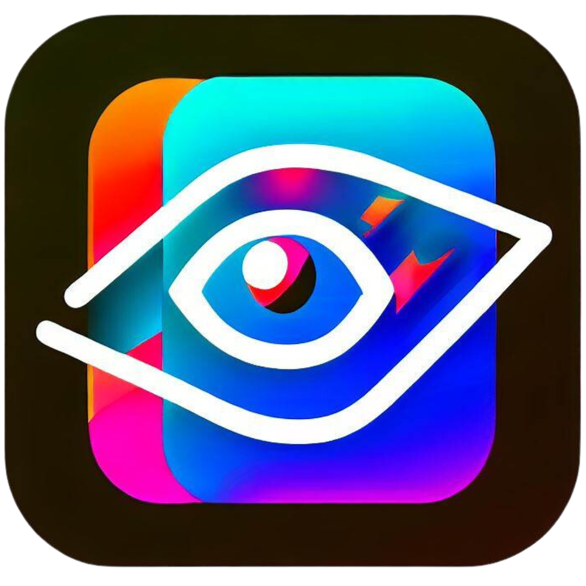

<h1 align="center">
  InvisiCipher : Deep Learning-Based image Steganography and more
</h1>

  

  <strong>Hide secrets, enhance images!</strong>

## Overview

Welcome to our Steganography and Super Resolution project! This project combines the power of steganography techniques and super-resolution using deep learning models. Our goal is to hide a secret image within a cover image using advanced convolutional neural networks (CNNs) and then enhance the quality of the hidden image using an Enhanced Super Resolution Generative Adversarial Network (ESRGAN). We also provide an option to encrypt the steg image using various chaos encryption algorithms for added security.

## Features

✨ **Interactive Hiding**: Utilize our intuitive hide network powered by CNNs to embed secret images within cover images effortlessly.

🔒 **Secure Encryption**: Choose from multiple chaos encryption algorithms such as AES, Blowfish to encrypt your steg image and protect your secrets.

🌟 **Enhanced Super Resolution**: Witness the magic of our ESRGAN model as it enhances the resolution and quality of the hidden image, revealing every detail.

🎨 **Easy-to-Use**: Our project provides a user-friendly interface and simple scripts to perform hiding, encryption, decryption, and image enhancement with just a few lines of code.

🪄 **Text-to-image**: Fast image generation from text prompts using transformers and diffusers .

## Project Architecture

The project architecture consists of the following components:

1. **Prepare Network**: A CNN-based network that prepares the secret image for hiding by extracting essential features and encoding it.

2. **Hide Network**: Another CNN-based network that embeds the prepared secret image within the cover image, producing the steg image.

3. **Chaos Encryption**: Choose between AES encryption, Blowfish encryption to secure your steg image.

4. **Chaos Decryption**: Decrypt the encrypted steg image using the corresponding decryption algorithm to retrieve the steg image.

5. **Reveal Network**: A CNN-based network that extracts the secret image from the steg image by decoding the hidden information.

6. **ESRGAN**: Our Enhanced Super Resolution Generative Adversarial Network (ESRGAN) model enhances the quality and resolution of the extracted secret image.

7. **Stable Diffusion pipeline** : Fast image generation from text prompts using transformers and diffusers .

## Getting Started

To get started with our project, follow these steps:

1. **Clone the Repository**: `git clone https://github.com/Asirwad/Image-Generation-WebApp-using-GenAI.git`

2. **Install Dependencies**: Install the required dependencies by running `pip install -r requirements.txt`.

3. **Run**: Run the streamlit app using `cd app` , `streamlit run app.py`

## Welcome screen

  

## Image hide

  

## Image reveal

  

## Super resolution

  

## image generation

  

## Contributing

We welcome contributions from the open source community. If you find any issues or have suggestions for improvements, please feel free to open an issue or submit a pull request.

## Acknowledgements

We would like to acknowledge the following resources and libraries used in this project:

-  TensorFlow: [↗️](https://www.tensorflow.org/)
-  PyTorch: [↗️](https://pytorch.org/)
-  Streamlit: [↗️](https://streamlit.io/)

## Contact

For any questions or inquiries, please contact us at [asirwadsali@gmail.com](mailto:asirwadsali@gmail.com).
